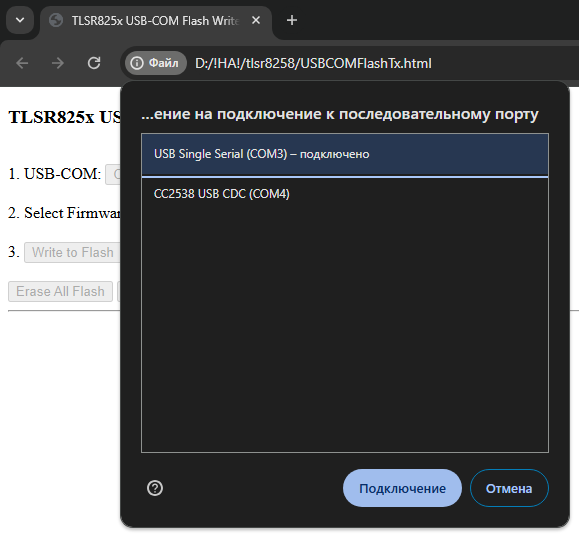
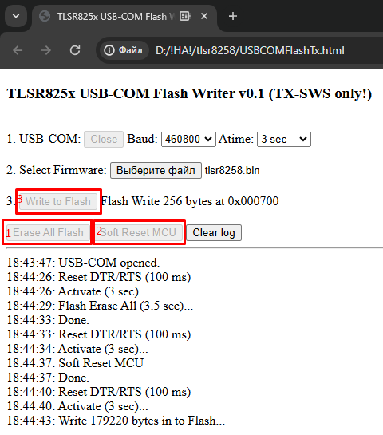

URL: https://github.com/mozolin/LilyGo_T-Zigbee_TLSR8258  
  
# Example: LilyGo T-Zigbee TLSR8258 (Telink SDK)  
  
Zigbe2MQTT Settings:  
[Example: Zigbee2MQTT CC2538 settings for ESP32-C3, ESP32-C6 and CC2530](https://github.com/mozolin/Zigbee2MQTT_CC2538)  
  
  
  
  
  

# Make firmware for TLSR8258 LilyGo T-ZigBee  
Before firmware update, adjust the DIP switch:  

1) Install Telink IDE – based on C/C++ Eclipse IDE (https://wiki.telink-semi.cn/wiki/IDE-and-Tools/IDE-for-TLSR8-Chips/)  
2) Unpack Zigbee_SDK-LilyGO.zip (https://github.com/Xinyuan-LilyGO/telink-zigbee-sdk) into C:\TelinkSDK\_src_  

3) Import as Existing Project  

4) Select C:\TelinkSDK\_src_\tl_zigbee_sdk folder, check «…\build\tlsr_tc32» project, DO NOT check «Copy projects into workspace» (path settings for the project may be incorrect!)  

5) Source code can be found in C:\TelinkSDK\_src_\tl_zigbee_sdk\apps\hciDevice folder  

6) Choose under «Build» menu (hammer icon) the item «_hciDevice_ZR_8258 (Route-8258)»  

7) Make sure, that the build was successful  

8) .BIN-file can be found here:  

9) Flash .BIN-file using TlsrComSwireWriter (https://github.com/pvvx/TlsrComSwireWriter)  

