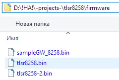
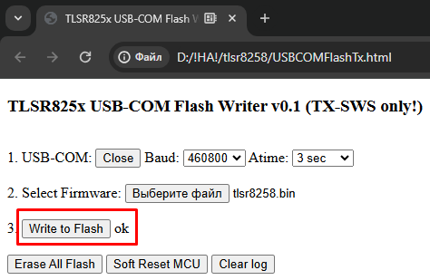

URL: https://github.com/mozolin/LilyGo_T-Zigbee_TLSR8258  
  
# Example: LilyGo T-Zigbee TLSR8258 (Telink SDK) with 8 endpoints for DS18B20 & BME280 & BH1750 sensors
  
Zigbe2MQTT Settings:  
[Example: Zigbee2MQTT CC2538 settings for ESP32-C3, ESP32-C6 and CC2530](https://github.com/mozolin/Zigbee2MQTT_CC2538)  
  
  
  
  
  
  
# Make firmware for TLSR8258 LilyGo T-ZigBee  
Before firmware update, adjust the DIP switch:  
  
  
1) Install Telink IDE – based on C/C++ Eclipse IDE (https://wiki.telink-semi.cn/wiki/IDE-and-Tools/IDE-for-TLSR8-Chips/)  
  
  
2) Unpack project zip-file into the folder  
  
  
3) Import as Existing Project  
  
  
4) Select "tlsr8258" folder, check «…\build\tlsr_tc32» project, DO NOT check «Copy projects into workspace» (path settings for the project may be incorrect!)  
  
  
5) Source code can be found in ..\tlsr8258\apps\hciDevice_ZR_8258 folder  
  
  
6) Choose under «Build» menu (hammer icon) the item «_hciDevice_ZR_8258 (Route-8258)»  
  
  
7) Make sure, that the build was successful  
  
  
8) .BIN-file can be found here:  
  
  
9) Flash .BIN-file using TlsrComSwireWriter (https://github.com/pvvx/TlsrComSwireWriter)  
  
  
  
  
  
The LED connected to the TX pin will blink during the erase and flashing processes  
  
